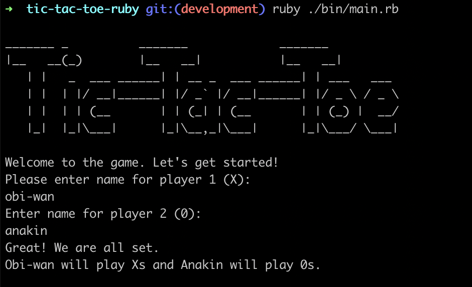
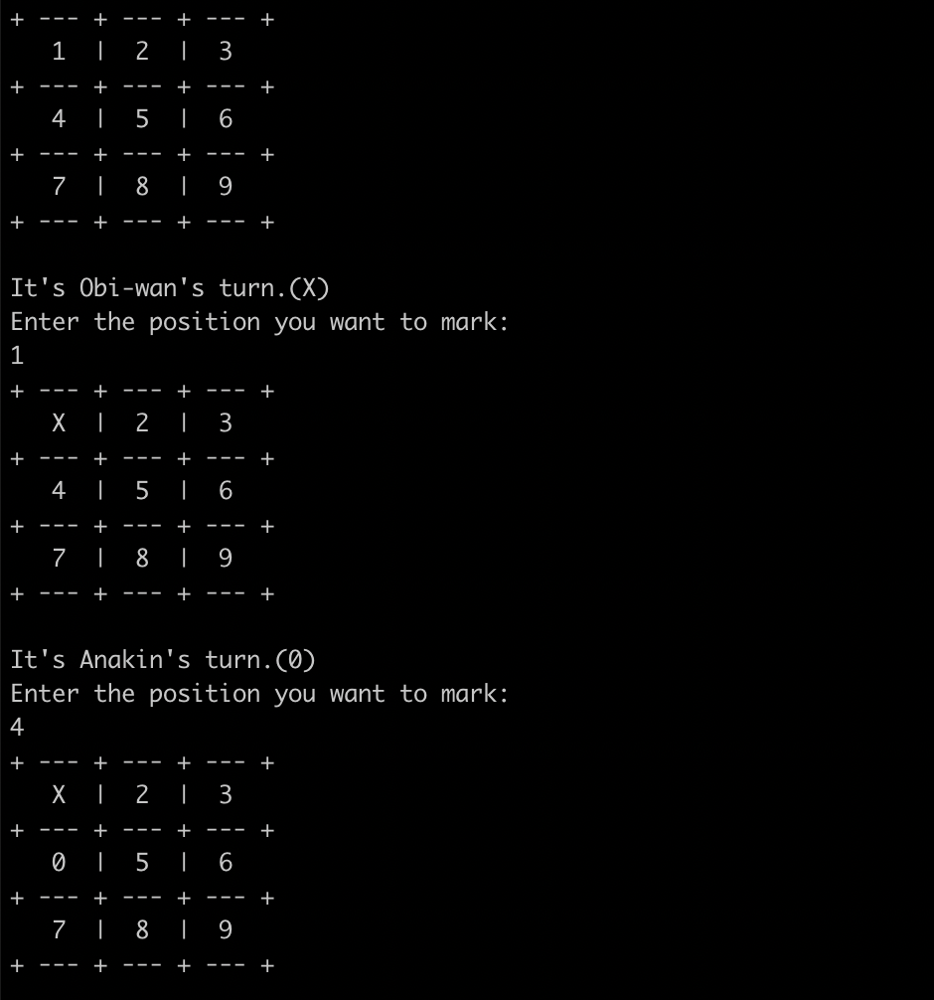
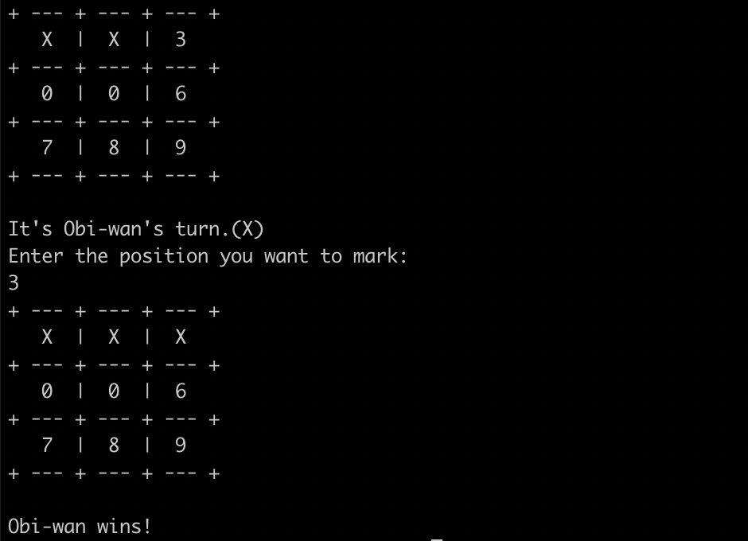

# Tic Tac Toe 

> Tic tac toe game (X - 0). Built with Ruby. Played in the command line or console. The simplest form of the commonly know game where the winner is the first to connect 3 marks.

---

First, te game asks for the name of the two players.

Players will take turns to choose an available position in the board.

 

If a players is succesfull in connecting 3 Xs or 0s then he is declared the winner! 

## Tic tac toe rules

- In a grid of 3 x 3 , with nine available positions, the players take turns to mark each cell until one player can connect 3 of his marks in a row.
- The three connected marks can be horizontal, vertical or diagonal.
- Once a cell has been marked it cannot be marked again. 

## Built With

- Ruby

## Getting Started

**To download this project git:**

 Clone it and then run the ruby command on the main file that is in the bin directory.

### Prerequisites

- Git
- Ruby language

### Install

- Install [Git](https://git-scm.com/book/en/v2/Getting-Started-Installing-Git)
- Install [Ruby](https://www.ruby-lang.org/es/documentation/installation/)

### Usage

1. Git clone this repo
2. cd into folder
3. Run: Ruby ./bin/main.rb

## Author

👤 **Elmer Lopez**

- GitHub: [@memelopez](https://github.com/memelopez/)
- Twitter: [@memelopez10](https://twitter.com/memelopez10)
- LinkedIn: [Elmer Lopez](https://www.linkedin.com/in/elmer-lopez-51b187200/)

## 🤝 Contributing

Contributions, issues, and feature requests are welcome!

Feel free to check the [issues page](../../issues/).

## Show your support

Give a ⭐️ if you like this project!

## 📝 License

This project is [MIT](./MIT.md) licensed.